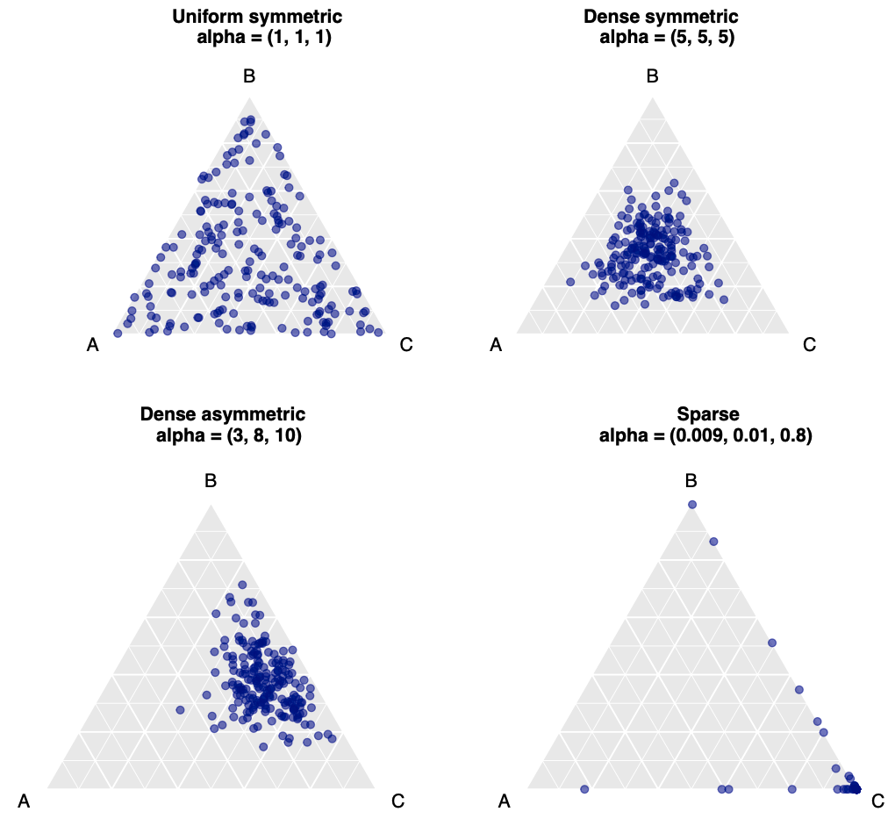

# metaDMM for Metagenomics

Metagenomics has risen into a transformative field that allows researchers to study the genetic material of entire microbial communities directly from environmental samples, providing unprecedented insights into microbial diversity, functions, and interactions.

When we talk about microbiome data, we're usually referring to the relative abundances of different microbial species in a sample. This data is compositional because it describes the proportions of microbes relative to each other, rather than absolute counts.

During my master thesis project, I got a chance to generate synthetic abundance data reflecting a microbial composition similar to that of a sewage environment. In order to simulate FASTQ reads as if generated from an actual sequencer, I applied a Python script ensuring that the reads representing individuals were present with a specific distribution on a taxon level – species in this case.

For this simulation, I used the Dirichlet-Multinomial model—a compound modeling approach that captures two key characteristics of microbiome abundance data. The multinomial component accounts for the proportions of different species based on their observed counts within each sample, while the Dirichlet component captures the variability in these proportions across samples.

## Multinomial and Dirichlet
The Dirichlet component, a probability distribution for modeling proportions, is especially useful for data constrained to sum to a fixed value, as it so happens with any microbiome data. It enables us to represent the uncertainty in species proportions across samples. For example, if we have proportions for three bacterial species, the Dirichlet distribution provides a range of possible values for each species' proportion across samples, rather than a single fixed estimate. In contrast, the multinomial component extends the binomial distribution to multiple discrete outcomes, modeling the likelihood of observing specific counts for each taxon in a given sample. This makes it well-suited for handling the species count data within each individual sample.



###### _Figure 1: Two-dimensional simplexes with different attributes represented by three different species with varying distributions across samples, with each dot in each triangular simplex chart representing a sample in a microbiome compositional dataset. Notice how the distribution of dots changes with the concentration parameter value (alpha) for each species as mentioned in the brackets_

The Dirichlet-Multinomial model (DMM) is a powerful tool for modeling compositional data, and the concentration parameter gives us insights into the balance or imbalance of microbial species in a sample. Understanding this can help interpret microbiome data more effectively, and it’s therefore widely used in microbiome studies to model the inherent variability in microbial compositions.

## metaDMM for synthetic reads

With the objective of applying the DMM for the FASTQ reads simulation, I recently got an idea of converting the Python scripts into an exhaustive one-line command line method called metaDMM. I have never developed a command line method before but with some research and assistance, I could figure out the files that are required to be set up, apart from the main Python script, for developing the command line method. 

## How to use metaDMM
metaDMM is a tool for generating synthetic DNA reads using a Dirichlet Multinomial distribution (DMM for Dirichlet Multinomial Modeling) from a set of genomes or existing reads that can be used as a reference for simulation. It simulates metagenomic data based on complete bacterial genomes with different concentration parameters (alpha).

### Installation

To install metaDMM, follow these steps:

1. Clone the repository:
   ```
   git clone https://github.com/aswatib/metaDMM.git
   ```

2. Navigate to the project directory:
   ```
   cd metaDMM
   ```

3. Install the package:
   ```
   pip install -e .
   ```

### Usage

To use metaDMM, run the following command:

```
metadmm --genome-folder /path/to/genomes --sample-folder /path/to/output --num-samples 5 --num-reads 1000 --read-length 150 --sparsity-factor 0.5
```

Arguments:
- `--genome-folder`: Path to the folder containing complete genomes or reference reads in .fasta or .fna format
- `--sample-folder`: Output folder for the generated samples
- `--num-samples`: Number of samples to generate (default: 20)
- `--num-reads`: Number of reads per genome (default: 1000)
- `--read-length`: Fixed read length (default: 200)
- `--sparsity-factor`: Sparsity factor for the Dirichlet distribution (default: 1.0)

### Output

The tool generates:
1. FASTQ files for each sample in the specified output folder.
2. A `stats.csv` file containing sample statistics.

## metaDMM shortcomings
Considering this is a new tool, it obviously has a wide range of improvement needs. For now the tool can generate reads based on a single and thus the same value of alpha or concentration parameter for all species categories. This is not indicative of how it is usually found in microbial habitats like sewage, feces or forest beds for that matter. All species vary in their concentration across different samples despite being taken from the same environment, event the same confined area. But the taxon-level reads generated through metaDMM are generated with the same alpha value.

Additionally, the reads are generated with the same quality score for each nucleotide, currently set to 40 or "I" for simplicity, but of course I would like to challenge myself to reach if not more realistic then at least random scores instead of the exact same for all -- which I believe is only a matter of a couple of more lines of the Python code to randomly extract and assign a score from a dictionary or list of Phred scores.

Finally, the simulated reads do not necessarily reflect the same alpha as it was set during the generation process using the command line method. This is because genomes or reference fasta used for simulation are, more often than not, of different lengths for different species. So even if the number of reads are a fixed value, the varying length of genomes / references add to the uncertain concentration parameter.

## Future perspective
I plan to figure out a way to ensure that there could be a range of concentration parameters, better still a vector of values as it should be, that the tool would accept for simulated reads. Additionally, I want to also make sure that even if the references are not of the same length, the concentration parameters remain the same for the outputted reads in line with the input values indicated in the run command.

If you would like to share your kind thoughts or suggestions on how I can improve this tool, please do leave a comment here. It will be very much appreciated.
Thank you for stopping by. Have a great time!

## Leave a comment
<script src="https://utteranc.es/client.js"
        repo="aswatib/RandomVariable"
        issue-term="pathname"
        theme="github-light"
        crossorigin="anonymous"
        async>
</script>
